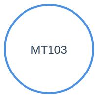
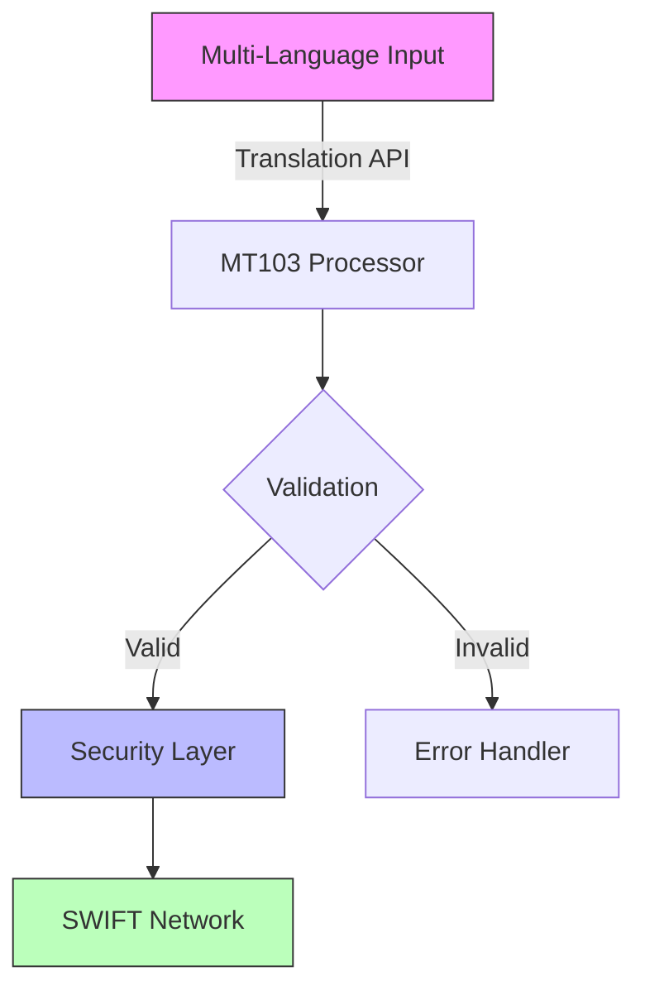

# Electronic MT103 Hard Copy System 🏦

<div align="center">
  
  
  [English](README.md) | [Español](docs/es/README.md) | [中文](docs/zh-cn/README.md) | [日本語](docs/ja/README.md) | [العربية](docs/ar/README.md)

  [](https://github.com/dFi0racle/Electronic-MT103-Hard-Copy/actions)
  [](https://crowdin.com/project/mt103-system)
</div>

<p align="center">
  
</p>

## 🌐 Global Support for SWIFT MT103 Processing

An enterprise-grade system for managing MT103 messages across multiple languages and regulatory frameworks.



## 📋 Table of Contents

- [Features](#-features)
- [System Architecture](#-system-architecture)
- [Installation](#-installation)
- [Documentation](#-documentation)
- [Security](#-security)
- [Contributing](#-contributing)
- [Support](#-support)
- [License](#-license)

## 🌟 Features

### Core Capabilities
- ✅ Complete MT103 message validation
- 🔐 Bank-grade security & encryption
- 📊 Real-time monitoring & analytics
- 🔄 Automated compliance checks
- 🌐 API integration support

### Security Features
- 🛡️ HSM Integration
- 🔑 Key rotation service
- 📝 Audit logging
- 🔒 Encryption verification

### Monitoring
- 📈 Prometheus metrics
- 📊 Grafana dashboards
- 🔍 Performance tracking
- ⚡ Auto-scaling support

## 🏗 System Architecture


## 🚀 Installation

```bash
# Clone the repository
git clone https://github.com/dFi0racle/Electronic-MT103-Hard-Copy.git

# Install dependencies
npm install
pip install -r requirements.txt

# Run the development environment
docker-compose up -d
```

## 📚 Documentation Structure

```
docs/
├── Implementation_Plan.md
├── API_Documentation.md
├── Security_Configuration.md
└── Process Guides
    ├── 01_MT103_Process_Overview.md
    ├── 02_Electronic_Processing.md
    └── 03_Templates/
```

### 🔄 MT103 Processing Flow


## 🛡️ Security Features

| Feature | Description | Status |
|---------|------------|---------|
| Encryption | AES-256 & RSA-4096 | ✅ |
| Key Rotation | Automatic every 24h | ✅ |
| Audit Logging | Immutable logs | ✅ |
| HSM Support | Hardware security | ✅ |

## 🔍 Monitoring & Metrics

### Performance Targets
- ⚡ API Response: ≤200ms
- 🎯 Uptime: ≥99.99%
- 📊 Error Rate: ≤0.01%
- 🔄 Recovery Time: ≤5min

### Dashboard Example
```
┌────────────────┐  ┌────────────────┐  ┌────────────────┐
│   Throughput   │  │  Error Rate    │  │   Latency      │
│   1000 tps     │  │    0.001%     │  │    150ms       │
└────────────────┘  └────────────────┘  └────────────────┘
```

## 🤝 Contributing

We welcome contributions! Please see our [Contributing Guide](CONTRIBUTING.md) for details.

### Contribution Flow


## 💬 Support

- 📧 Email: support@example.com
- 💻 GitHub Issues
- 📱 Slack Channel: #mt103-support

## 📄 License

This project is licensed under the MIT License - see [LICENSE.md](LICENSE.md) for details.

---

<div align="center">

**Made with ❤️ by the MT103 Team**

[Documentation](docs/) • [API Reference](docs/API_Documentation.md) • [Security](docs/Security_Configuration.md)

</div>