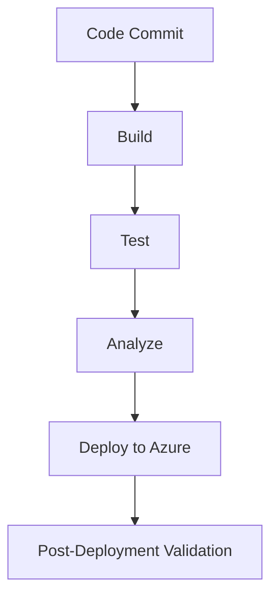

# CI/CD Pipeline Documentation

The Electronic MT103 Hard Copy system uses GitHub Actions for Continuous Integration and Continuous Deployment.

## Pipeline Overview

## Workflow Details

### Build Stage
- Installs Node.js dependencies using PNPM
- Compiles TypeScript code
- Builds React frontend components

### Test Stage
- Runs unit tests
- Runs integration tests
- Validates compliance rules

### Analysis Stage
- Runs code quality analysis
- Performs security scanning
- Validates against SWIFT standards

### Deployment Stage
- Authenticates with Azure
- Applies infrastructure as code
- Deploys application package
- Configures environment settings

## Configuration Files

- **Main Workflow**: [`.github/workflows/azure-deployment.yml`](/.github/workflows/azure-deployment.yml)
- **Infrastructure**: [`/infra/main.bicep`](/infra/main.bicep)

## Security Considerations

- Secrets are stored in GitHub Actions secrets
- OIDC is used for Azure authentication
- Infrastructure is defined as code with Bicep

## Deployment Environments

| Environment | Branch | URL |
|-------------|--------|-----|
| Production | main | https://mt103-production.azurewebsites.net |
| Staging | develop | https://mt103-staging.azurewebsites.net |
| Preview | PR | https://mt103-preview.azurewebsites.net |

## Manual Deployment

If needed, you can trigger manual deployment:

1. Go to the GitHub Actions tab
2. Select the "Azure MT103 Deployment" workflow
3. Click "Run workflow"
4. Select the branch to deploy
5. Click "Run workflow"

## Rollback Procedure

To roll back to a previous version:

1. Find the commit hash of the stable version
2. Manually trigger deployment with that commit
3. Verify application functionality post-rollback
